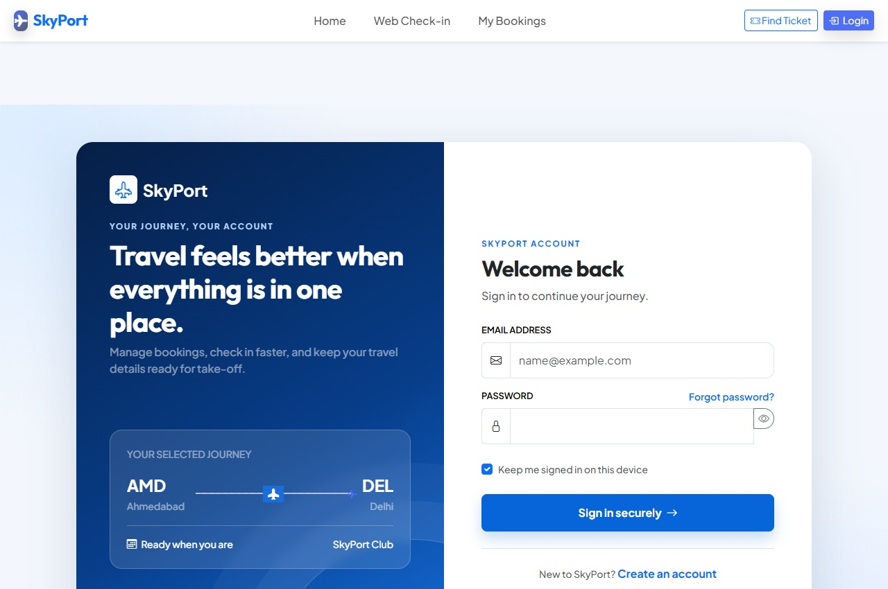
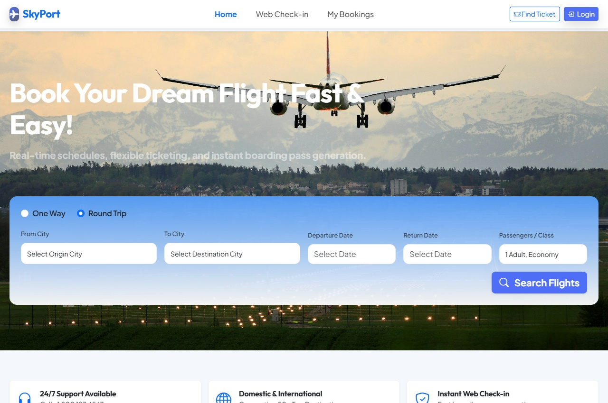
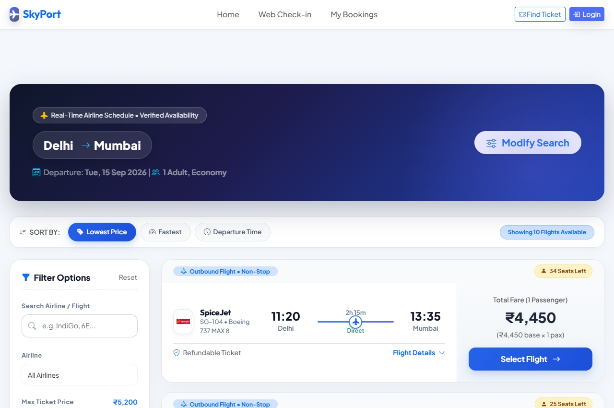
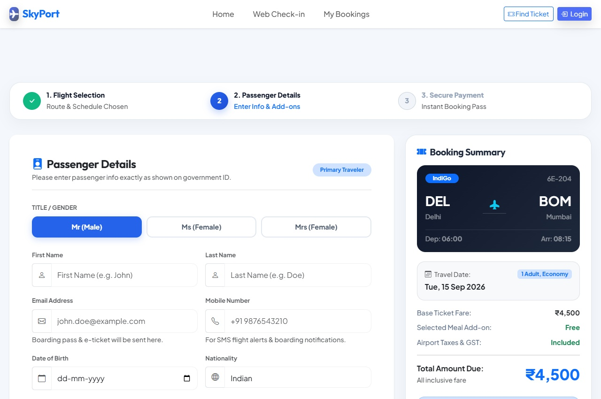
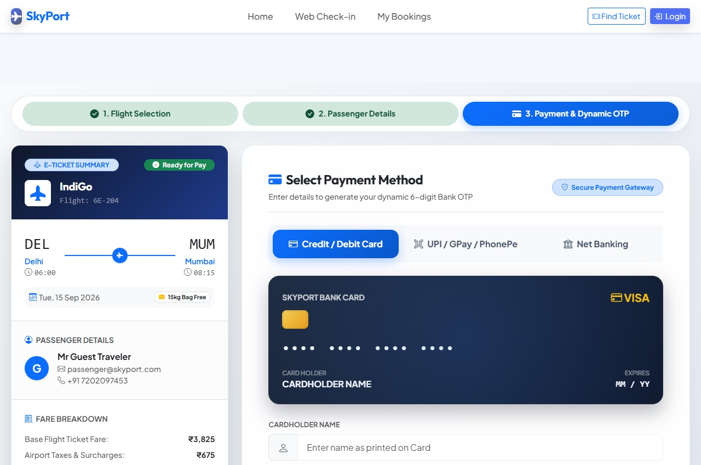
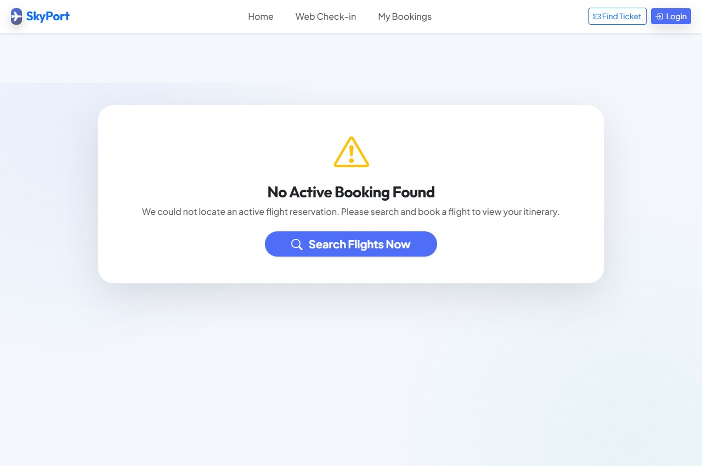
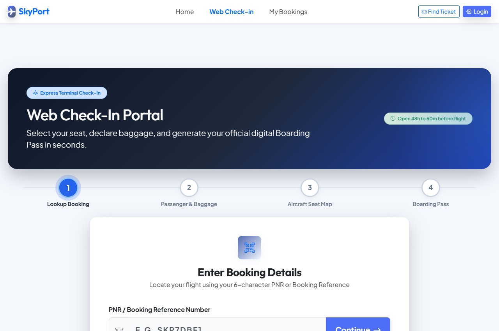
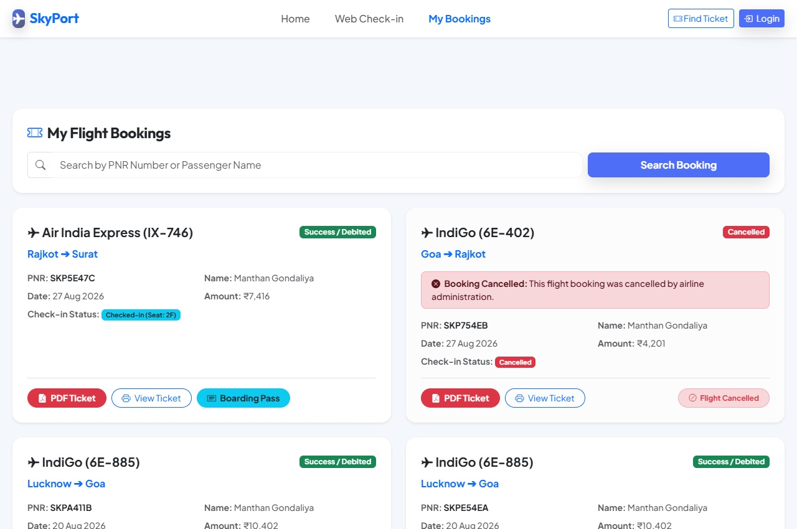
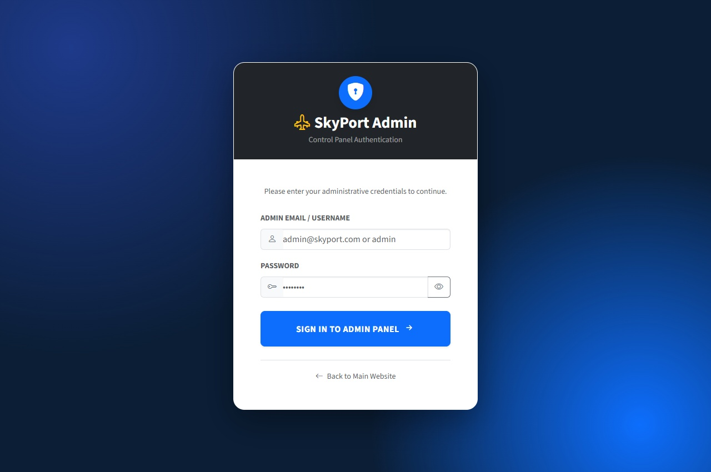

# ✈️ SkyPort — Airline Ticket Booking System
## Student Academic Project Report & Easy Technical Documentation

---

## 📜 STUDENT PERSONAL INTRO & PROJECT CERTIFICATE

- **Student Name**: Manthan
- **Academic Semester**: Semester 5 (Sem-5)
- **Department / Branch**: Department of Computer Science & Engineering
- **College / Institute**: Institute of Engineering & Technology
- **Project Name**: SkyPort Airline Ticket Booking & Management System
- **Core Technologies**: PHP 8+, HTML5, Custom CSS3, ES6 JavaScript, JSON Database
- **Submission Date**: August 27, 2026

---

## 1. Easy Step-by-Step Project Flow & Real Website Screenshots

### Step 1: User Account Login & Security (`login.php`)

- **How It Works Simply**:
  1. User enters registered email and password.
  2. Passwords are saved safely using PHP `password_hash()` (Bcrypt encryption).
  3. User email is stored in `$_SESSION['user_email']` so you stay logged in securely.
  4. Redirects straight to `index.php` without showing passwords or emails in the URL bar.

---

### Step 2: Home Page & Dynamic Flight Search Box (`index.php`)

- **How It Works Simply**:
  1. **Search Box**: User picks Origin city, Destination city, Departure date, and Passengers.
  2. **Dynamic City Hiding**: Selecting "Delhi" in From city automatically hides "Delhi" from To city dropdown list via `syncCityOptions()` so you cannot pick the same city for origin & destination!
  3. **Date & Passengers**: Flatpickr calendar selects dates easily while counters set Adult/Child travelers.

---

### Step 3: Flight Fleet Selection & Ticket Fares (`flight.php`)

- **How It Works Simply**:
  1. Queries `flights.json` in real-time and displays matching flight schedules across Indian metro hubs.
  2. Displays airline brand logos (IndiGo, Air India, SpiceJet) with departure time, arrival time, and duration.
  3. Shows clear ticket prices per passenger and dynamic route schedule generator.

---

### Step 4: Passenger Details & Checkout Form (`detail.php`)

- **How It Works Simply**:
  1. Traveler fills First Name, Last Name, Email, and Mobile Phone number.
  2. Calculates total ticket price including taxes based on Economy, Business, or First Class.
  3. Ensures no empty inputs and saves temporary booking state before payment.

---

### Step 5: Payment Gateway & Simulated OTP Verification (`payment.php`)

- **How It Works Simply**:
  1. Choose Credit/Debit Card, UPI Instant, or NetBanking payment option.
  2. Interactive simulated OTP verification pop-up modal appears for payment approval.
  3. Entering OTP generates a unique 6-character PNR code (e.g. `SKP982`) and saves to `bookings.json`.

---

### Step 6: Booking Confirmation & Digital Ticket Stub (`confirmation.php`)

- **How It Works Simply**:
  1. Green success banner shows booking is confirmed. 1-Click Copy PNR button copies code.
  2. Clicking "Download PDF Ticket" streams a clean A4 PDF ticket created directly in PHP via `SkyPortPDF`.
  3. Sends formatted E-ticket HTML email and SMS confirmation message.

---

### Step 7: Instant Web Check-In & Gate QR Pass (`webcheckin.php`)

- **How It Works Simply**:
  1. Enter 6-character PNR code to retrieve ticket itinerary instantly.
  2. Passenger picks aircraft seat (e.g. Seat 12F) and meal preferences under 30 seconds.
  3. Generates live Boarding Pass with Gate A12 / Zone 2 QR Code for terminal scanners.

---

### Step 8: Traveler Dashboard & Admin Cancellation Sync (`mybooking.php`)

- **How It Works Simply**:
  1. Automatically retrieves all user tickets via logged-in email or PNR search.
  2. If Admin cancels a flight schedule in Admin Panel, ticket shows a bold red `CANCELLED` status badge and warning notice.
  3. Enables downloading PDF tickets and viewing boarding passes directly from dashboard.

---

### Step 9: Super-Admin Control Panel & Analytics (`admin/index.php`)

- **How It Works Simply**:
  1. Super-admin control dashboard displaying Active Flights count, Total Bookings, and Total Revenue analytics counters.
  2. Allows adding new flight routes, updating ticket prices, and deleting flight schedules.
  3. Deleting a flight automatically marks passenger bookings as `Cancelled` in My Bookings.

---

## 2. Super Easy Viva Speaking Script & Short Answers

### 🎙️ Viva Intro (Bolne ke liye lines):
> *"Good morning Sir/Ma'am. Mera naam **Manthan** hai, Semester 5 CSE ka student. Mera project hai **SkyPort — Airline Ticket Booking System**. Yeh ek full-stack web application hai jisme user flight search karke ticket book karta hai, 6-character PNR code paata hai, PDF ticket download karta hai, Web Check-in karke Seat 12F chunata hai, aur Admin panel se flights manage hoti hain."*

### ❓ Top 4 Expected Viva Questions:

1. **Question: Database kya hai?**
   - **Answer**: *"Sir, humne lightweight **JSON Flat-File Database** (`flights.json`, `bookings.json`) with `LOCK_EX` file locking use kiya hai. Isse fast read/write hota hai bina heavy SQL setup ke."*

2. **Question: Search box me special feature kya hai?**
   - **Answer**: *"Sir, search box me **Dynamic City Hiding** hai. Jab user Origin (e.g. Delhi) chunata hai, to JavaScript `syncCityOptions()` instantly Destination dropdown se Delhi ko hide kar deta hai taaki wrong route booking na ho."*

3. **Question: PDF Ticket kaise banta hai?**
   - **Answer**: *"Sir, humne pure-PHP me custom `SkyPortPDF` class likhi hai jo in-memory A4 vector PDF tickets direct generate karti hai."*

4. **Question: Admin flight cancel kare to kya hoga?**
   - **Answer**: *"Sir, Admin Panel me flight delete hone par `bookings.json` me status `Cancelled` update hota hai aur user ke My Bookings dashboard me red badge dikhta hai."*

---

## 3. Direct File Links

- **10-Page Official College PDF Report**: [SkyPort_Project_Documentation.pdf](file:///c:/xampp1/htdocs/airport/project/SkyPort_Project_Documentation.pdf)
- **PDF Download Generator Script**: [generate_docs_pdf.php](file:///c:/xampp1/htdocs/airport/project/generate_docs_pdf.php)
- **Interactive Web Documentation Page**: [project_documentation.php](file:///c:/xampp1/htdocs/airport/project/project_documentation.php)
